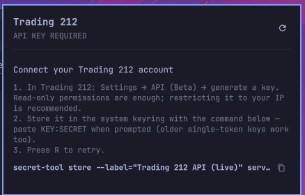

# Omarchy Trading212 Plugin

Your [Trading 212](https://www.trading212.com/) portfolio in the [Omarchy](https://omarchy.org/) status bar: how much you have invested and your P/L at a glance, with a click-to-open panel showing the full account summary and every open position.

Built for the Omarchy 4.x shell (`omarchy-shell` / Quickshell) as a `bar-widget` plugin. It does not work on Omarchy ≤ 3.x (Waybar).



## Features

- **Five bar display modes**, cycled with a **right-click**:
  | Mode | Bar shows |
  |---|---|
  | Value + P/L | `€12.8k +€322` — current worth of your investments and signed P/L |
  | Daily change | `+€12.40 +0.5%` — today's move vs yesterday's closing snapshot (on install day: vs the day's first reading) |
  | P/L percent | `+2.6%` / `-4.0%` |
  | Total value | `€12.9k` (investments + cash) |
  | Privacy | `T212 ▲` — direction only, no amounts anywhere (including the tooltip) |
- **Left-click** opens the detail panel: invested / value / P/L / free cash, a **portfolio graph** built from the plugin's own daily snapshots (hover for per-day values; the Trading 212 API exposes no history, so the graph grows from install day), plus all open positions with per-position value and P/L. **Middle-click** (or `R` in the panel) forces a refresh.
- The bar label always uses the theme's bar foreground (the +/− sign carries the direction), so it stays readable on every Omarchy theme; inside the panel, P/L is colored with the theme's accent (profit) and urgent (loss) colors.
- The cycled mode is persisted to `shell.json`, so it survives shell restarts.
- Records one **daily portfolio snapshot** to `~/.local/state/omarchy-trading212/history-<env>.jsonl` — the dataset behind the graph and the daily-change mode. Each line keeps the day's opening and closing value; the graph also plots a live "now" point, so it moves intraday. (The Trading 212 API has no history endpoints, so everything is derived locally — daily change needs one prior day on record before it compares against a real close.)

## Install

```sh
omarchy plugin add https://github.com/simasrazinskas/omarchy-trading212-plugin.git --enable
```

Then place it on the bar if it doesn't appear automatically:

```sh
omarchy bar put io.github.simasrazinskas.trading212 right
```

## Uninstall

```sh
omarchy plugin remove io.github.simasrazinskas.trading212
```

The plugin leaves behind only two things, both yours to keep or delete:

```sh
secret-tool clear service trading212 account live    # the API key (and `account demo` if set)
rm -rf ~/.local/state/omarchy-trading212             # summary cache + daily snapshot history
```

## Connect your Trading 212 account

The plugin talks directly to the official [Trading 212 public API](https://docs.trading212.com/api) (Invest and Stocks ISA accounts; CFD is not supported by the API).

1. In Trading 212 (app or web): **Settings → API (Beta)** → generate an API key.
   - **Read-only permissions are enough** — this plugin never places orders; granting it nothing else is safest.
   - Restricting the key to your IP is recommended by Trading 212.
   - The **secret is shown only once** at creation; copy it immediately.
2. **Left-click the widget** and paste the key into the panel's input field as `KEY:SECRET` (a legacy single-token key also works — paste it as-is), pick LIVE or DEMO, and hit SAVE. Done.

Prefer the terminal? The equivalent manual command is:

```sh
secret-tool store --label="Trading 212 API (live)" service trading212 account live
```

or script it via IPC: `omarchy-shell io.github.simasrazinskas.trading212 setKey "KEY:SECRET"` — note that unlike the panel input, this puts the key in the command's argv and your shell history, so prefer the panel or `secret-tool` for interactive use.

### Why the keyring?

The credential goes from the input field to your system keyring (gnome-keyring ships with Omarchy) over the storing process's stdin — it is never written to a config file, never passed on a process command line, and never appears in `shell.json` or this plugin's settings. At request time the widget runs `secret-tool lookup`, and the `Authorization` header is handed to `curl` via `--config` on stdin. Locked keyring = no requests.

### Practice (demo) account

Keys are per-environment: a key generated while in Practice mode only works against the demo API. To point the widget at a practice account, store the demo key:

```sh
secret-tool store --label="Trading 212 API (demo)" service trading212 account demo
```

and set the environment in `~/.config/omarchy/shell.json` on the widget's bar entry:

```json
{ "id": "io.github.simasrazinskas.trading212", "environment": "demo" }
```

## Settings

| Key | Default | Meaning |
|---|---|---|
| `refreshIntervalSec` | `60` | Poll interval (15–3600 s). Also editable in the bar's widget settings UI. |
| `environment` | `live` | `live` or `demo`. |
| `mode` | `invested` | Current display mode; normally you just right-click instead of editing this. |

The account-summary endpoint is rate-limited to 1 request / 5 s by Trading 212, so the 60 s default is conservative; the minimum of 15 s stays well clear of it. Manual refreshes (middle-click, IPC) are additionally floored at one summary fetch per 6 s, so you can't trip a 429 by mashing the widget. Mode switching never touches the API — it just re-renders cached data. Transient failures (rate limit, network blips, server errors) never replace data you already have: the widget keeps showing the cached numbers and silently retries after 15 s; errors are only shown when there is no data at all or the key itself is missing/rejected.

## IPC

```sh
omarchy-shell io.github.simasrazinskas.trading212 toggle    # open/close the panel
omarchy-shell io.github.simasrazinskas.trading212 refresh
omarchy-shell io.github.simasrazinskas.trading212 cycle     # next display mode
omarchy-shell io.github.simasrazinskas.trading212 status    # JSON state
```

## Development

```sh
tests/run                      # node unit tests + manifest validation
omarchy plugin validate .      # manifest only
```

`Model.js` is pure JavaScript (parsing + formatting) shared between the QML widget and the node test suite. `Service.qml` owns polling and keyring access; `Panel.qml` is the bar widget and popup panel.

## License

[MIT](LICENSE). Not affiliated with Trading 212 or Omarchy.
