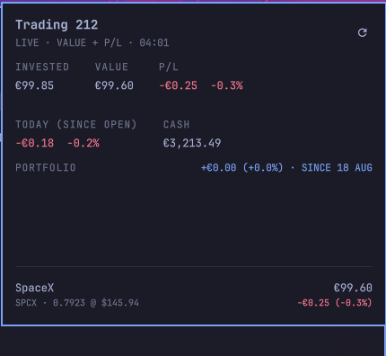
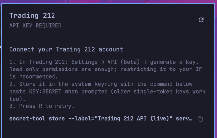

# Omarchy Trading212 Plugin

Your [Trading 212](https://www.trading212.com/) account in the [Omarchy](https://omarchy.org/) status bar: account value and P/L at a glance, and a click-to-open panel that works as a small portfolio monitor. The panel covers holdings with live market data, spending from the card pot, a full activity timeline, allocation and dividend insights, and desktop alerts.

Built for the Omarchy 4.x shell (`omarchy-shell` / Quickshell) as a `bar-widget` plugin. It does not work on Omarchy ≤ 3.x (Waybar).

<p>
  
  
</p>

## Features

### In the bar

Six display modes, cycled with a **right-click**:

| Mode | Bar shows |
|---|---|
| Value + P/L | `€12.8k +€322`: current worth of your investments and unrealized P/L |
| Daily change | `+€12.40 +0.5%`: today's move in *return*, so deposits, sales and spending don't count as gains |
| P/L percent | `+2.6%` / `-4.0%` |
| Account value | `€13.4k`: the whole account, including cash and the spending pot |
| Spent this month | `Spent €235`: card spending so far this calendar month |
| Privacy | `T212 ▲`: direction only, no amounts anywhere, including the tooltip |

**Left-click** opens the panel. **Middle-click** refreshes everything. The tooltip summarizes account value, pot and cash, P/L, today, and this month's spend.

### In the panel

| Tab | What's in it |
|---|---|
| **Overview** | Account value split into investments, pot and cash. Today's move. Invested, value, P/L, realized, total return. A graph of **Return**, **Account** or **Invested** over 1W–ALL. US market session, CNN Fear & Greed, EUR/USD. Today's biggest movers. Earnings, ex-dividend and payment dates in the next 3 weeks. Pending orders. |
| **Holdings** | Every position with today's move, weight, value and P/L, sortable by value, P/L, P/L %, today or name. Pies with goal progress and current-vs-target slices. **Enter** or click opens a holding's page: price chart (1M–1Y) with your average price marked, 52-week range, your position (cost, shares, opened, FX impact, dividends), company data (sector, market cap, P/E, analyst target, yield, ex-dividend, next earnings and consensus EPS), your trades, and recent headlines. |
| **Cash** | Spending pot and trading cash. **Spent this month**, with pace against the same day last month, month-end projection and monthly average. Spending per day (30 days) or month (12 months). Cashback, fees, interest, top-ups, withdrawals to the bank. Biggest payments. A weekday pattern. Pot balance over time. |
| **Activity** | One day-grouped timeline of trades (with realized P/L and fees), dividends, top-ups, card spending, cashback and fees, filterable by kind. |
| **Insights** | All-in performance: unrealized + realized + dividends, and trading fees paid. Allocation by holding, sector or currency. Concentration (top 1/3/5). Dividend income: last 12 months, this year, projected per year. Trading habits. Fear & Greed with history, and ECB FX rates. |

A **Settings** view (gear, or `,`) holds the account (live/demo), refresh interval, market data on/off, notification rules and the spending heuristic.

### Keyboard

| Key | Action |
|---|---|
| `1`–`5`, `h` / `l`, `←` / `→` | Switch tab |
| `j` / `k`, `↑` / `↓` | Scroll; in Holdings, move the cursor |
| `Enter` / `Space` | Open the holding under the cursor |
| `Backspace` | Back (holding page, settings) |
| `r` | Refresh everything |
| `,` | Settings |
| `m` / `g` | Overview: cycle graph metric / range |
| `s` | Holdings: cycle sort |
| `o` | Holding page: open in Yahoo Finance |
| `c` | Cash: toggle days / months |
| `f` | Activity: cycle filter |
| `a` | Insights: cycle allocation grouping |
| `Tab` | Next bar panel |
| `Esc` | Close |

### Notifications

Desktop notifications go through `omarchy-notification-send`, and clicking one opens the panel. You're notified when:

- the portfolio moves ±2% in a day (again at every further multiple of the threshold)
- a holding moves ±5% in a regular session
- an order fills
- a dividend is paid
- a holding reports earnings tomorrow or today

Thresholds and each kind are configurable in Settings. Past history never notifies: the first sync is recorded silently.

## How the numbers work

- **Account value** is Trading 212's `totalValue`. The API doesn't break out the card **spending pot**, so it's derived as `totalValue − investments − trading cash`.
- **Today** and the **Return** graph measure *return* (unrealized + realized P/L), not value. Buying, selling, depositing or spending moves value without being a gain or loss. A value graph would show a sell-off into cash as a crash.
- **History.** The API has no history endpoint for balances, so the plugin keeps one snapshot per day in `~/.local/state/omarchy-trading212/history-<env>.jsonl`. Realized P/L for days before that is rebuilt from your order fills, so the Return graph covers your whole snapshot history from the first sync. The Account graph starts from the day pot tracking began.
- **Spending.** Card payments appear in the API as plain `WITHDRAW` transactions, and cashback as tiny `DEPOSIT`s. The Cash tab therefore estimates:
  - a withdrawal of a whole amount ≥ €100 is a **bank transfer**
  - any other withdrawal is **card spending**
  - a deposit under €1 is **cashback**

  The transfer threshold is adjustable in Settings. No merchant data is available.

## Install

```sh
omarchy plugin add https://github.com/simasrazinskas/omarchy-trading212-plugin.git --enable
```

Then place it on the bar if it doesn't appear automatically:

```sh
omarchy bar put io.github.simasrazinskas.trading212 right
```

## Uninstall

```sh
omarchy plugin remove io.github.simasrazinskas.trading212
```

The plugin leaves behind only two things, both yours to keep or delete:

```sh
secret-tool clear service trading212 account live    # the API key (and `account demo` if set)
rm -rf ~/.local/state/omarchy-trading212             # snapshots, history and market caches
```

## Connect your Trading 212 account

The plugin talks directly to the official [Trading 212 public API](https://docs.trading212.com/api). It supports Invest and Stocks ISA accounts; the API doesn't support CFD.

1. In Trading 212 (app or web), go to **Settings → API (Beta)** and generate an API key.
   - **Read-only is enough.** This plugin never places orders. To light up every tab, tick **Account, Portfolio, Orders (read), History (orders, dividends, transactions), Pies (read)** and **Metadata**. A feature whose permission is missing just goes dark; Settings lists what's missing.
   - Trading 212 recommends restricting the key to your IP.
   - The **secret is shown only once**, at creation. Copy it immediately.
2. **Left-click the widget** and paste the key into the panel as `KEY:SECRET`. A legacy single-token key also works; paste it as-is. Pick LIVE or DEMO, and hit SAVE.

Prefer the terminal? The equivalent manual command is:

```sh
secret-tool store --label="Trading 212 API (live)" service trading212 account live
```

You can also script it via IPC: `omarchy-shell io.github.simasrazinskas.trading212 setKey "KEY:SECRET"`. Unlike the panel input, this puts the key in the command's argv and your shell history, so prefer the panel or `secret-tool` for interactive use.

### Why the keyring?

The credential goes from the input field to your system keyring (gnome-keyring ships with Omarchy), over the storing process's stdin. It is never written to a config file, never passed on a process command line, and never appears in `shell.json` or this plugin's settings.

At request time the plugin runs `secret-tool lookup`, and the `Authorization` header is handed to `curl` via `--config` on stdin. A locked keyring means no requests.

### Practice (demo) account

Keys are per environment: a key generated in Practice mode only works against the demo API. Switch **Account → Practice** in Settings, then paste the demo key. Each environment keeps its own cache, history and alert log.

## Market data and privacy

Enrichment uses free public sources that need no keys:

| Source | Used for | Refresh |
|---|---|---|
| Nasdaq (`api.nasdaq.com`) | Quotes, session state, 52-week range, sector and fundamentals, dividend dates, next earnings, 1-year daily prices | Quotes every 2 min while the panel is open (10 min otherwise), profiles and earnings daily, charts every 6 h |
| Frankfurter (ECB) | FX rates | Twice a day |
| CNN | Fear & Greed index | Hourly |
| Google News RSS | Headlines on a holding's page | On open, cached 30 min |

Only ticker symbols and company names leave your machine; amounts and account data never do. Nasdaq covers US listings only, so other listings show Trading 212's own price. Everything is cached in `~/.local/state/omarchy-trading212/market.json`. The whole feature can be switched off in Settings (`"marketData": false`).

## Settings

Everything is editable in the panel's Settings view and persists to the widget's entry in `~/.config/omarchy/shell.json`:

| Key | Default | Meaning |
|---|---|---|
| `refreshIntervalSec` | `60` | Poll interval (15–3600 s). |
| `environment` | `live` | `live` or `demo`. |
| `mode` | `invested` | Bar display mode; normally you just right-click. |
| `marketData` | `true` | Public market-data enrichment. |
| `alerts` | `true` | Desktop notifications. |
| `alertPortfolioPct` / `alertPositionPct` | `2` / `5` | Move thresholds, in %. |
| `alertFills` / `alertDividends` / `alertEarnings` | `true` | Per-kind notification switches. |
| `transferMin` | `100` | Whole withdrawals at or above this count as bank transfers, not spending. |
| `chartMetric`, `chartRange`, `holdingsSort`, `cashChart`, `activityFilter`, `allocationBy` | — | Remembered view choices. |

**Rate limits.** Every Trading 212 request goes through one serial queue with a per-endpoint floor slightly above the documented limits:

| Endpoint | Floor |
|---|---|
| Summary | 1 / 5 s |
| Positions | 1 / 1 s |
| History | 6 / min |
| Pies | 1 / 30 s |

Mashing refresh can't trip a 429.

**Failures.** Transient failures (rate limit, network blips, server errors) never replace data you already have: the widget keeps the cached numbers and retries after 15 s. It only shows an error when there's no data at all, or when the key itself is missing or rejected.

**History sync.** The first sync backfills your whole order, dividend and transaction history; later syncs fetch only new pages.

## IPC

```sh
omarchy-shell io.github.simasrazinskas.trading212 toggle          # open/close the panel
omarchy-shell io.github.simasrazinskas.trading212 tab cash        # open on a tab
omarchy-shell io.github.simasrazinskas.trading212 position NVDA   # open a holding's page
omarchy-shell io.github.simasrazinskas.trading212 settings
omarchy-shell io.github.simasrazinskas.trading212 refresh         # everything
omarchy-shell io.github.simasrazinskas.trading212 sync            # account history only
omarchy-shell io.github.simasrazinskas.trading212 cycle           # next display mode
omarchy-shell io.github.simasrazinskas.trading212 status          # JSON state
omarchy-shell io.github.simasrazinskas.trading212 summary         # JSON account numbers ({} in privacy mode)
omarchy-shell io.github.simasrazinskas.trading212 testAlert       # send a test notification
```

## Development

```sh
tests/run                      # node unit tests + manifest validation
omarchy plugin validate .      # manifest only
```

Layout:

```
Panel.qml          host: bar label, panel frame, tabs, keyboard map, IPC
Service.qml        Trading 212 data layer: summary, positions, pending orders, pies,
                   daily snapshots; composes the services below
services/          RequestQueue (rate-limited serial runner), StateFile (atomic JSON
                   store), AccountHistory (history sync), MarketData (enrichment),
                   AlertCenter (notifications)
views/             one file per tab, plus PositionDetail, Settings and Setup
components/        Theme, charts (LineChart, BarChart, AllocationBar, RangeBar),
                   ListRow, Stat/StatGrid, Card, Scroller, …
lib/               pure JavaScript (QML `.pragma library`): Format, T212 parsing,
                   Portfolio math, Cash analysis, Activity timeline, Market parsing,
                   Bar labels, Alert rules, Icons
tests/             node --test suites for every lib/ module; harness.js loads the
                   QML-style scripts, `.import` lines included
```

All logic that can be pure lives in `lib/` and is covered by tests. QML files only wire data to processes and pixels. The shell caches compiled components, so after editing a deployed copy run `omarchy restart shell`.

## License

[MIT](LICENSE). Not affiliated with Trading 212, Nasdaq, CNN, or Omarchy.
